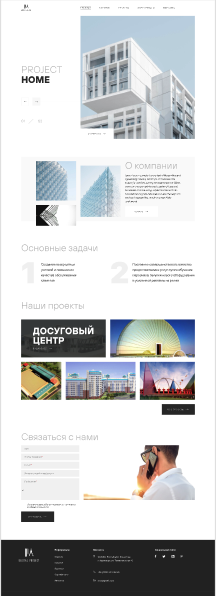

# Digital Project
### A simple landpage - the business card of an architectural studio. Simply navigate the site using anchor links. A hover effect was added to the buttons.

<kbd> 

</kbd>

## Features:
- Semantic markup, BEM

## Technology:
- HTML5
- SASS
- Webpack
- CSS3

## Live page - [Digital Project](https://tinkkid.github.io/Digital-Project-demo/)